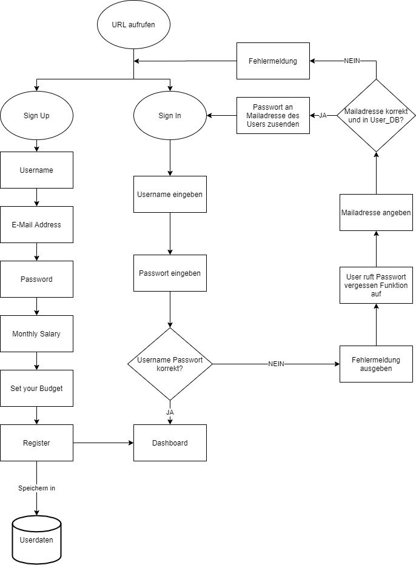

# Projekt: Oktofinance 2.0
## Ausgangslage / Problemstellung
Die bestehenden Spar und Budgetfunktionen im E-Banking sind nicht sexy und machen einfach keinen Spass. Die meisten Leute kennen diese Funktionen nicht einmal, da das E-Banking kein Ort ist, an dem man sich länger als nötig aufhalten möchte.

Ein weiteres Problem besteht darin, dass der Zeitpunkt, an dem man darauf hingewiesen wird, dass man jetzt spätestens sparen muss, in diesen Tools nicht akkurat ist. Das Geld ist meist schon ausgegeben, bis man sich Ende Monat wieder im E-Banking einloggt und den dortigen Sparplaner aufruft.
Vielen Menschen fehlt die Motivation ihr Budget zu planen. Der damit verbundene Aufwand (Transaktionen kategorisieren, Sparziele festlegen, Analysen etc.) schreckt einen Grossteil der potenziellen Nutzer ab.

## Projektidee
Wir wollen, eine Web-App programmieren, die durch Einfachheit und Nuterfreundlichkeit besticht. Dies soll die Nutzer motivieren, sich mit dem Sparen auseinanderzusetzen. Wir möchten ihnen dabei helfen, finanzielle Entscheide besser treffen zu können. 

Sparziele sollen keine weit entfernten Träume mehr darstellen, sondern Realität werden.

Ziel des Projektes ist eine Budgetplanungs-Applikation zu bauen, mit welcher man sein Budget für verschiedene anstehende Ausgaben (z.B. Lebensmittel, Ferien, Kleider, Arztrechnungen etc.) des täglichen Lebens planen kann. Wir haben uns für eine Web-App entschieden, damit Sparen wieder spass macht und man mit Freude sein Budget plant.

## Getting Started
1. Clone Repository https://github.com/cedriccarrel/prog2
2. pip install Flask-Mail, conda install plotly, conda install -c conda-forge matplotlib
3. start python app.py
4. Open http://localhost:5000/login
5. Siehe Funktionen und Flowchart für Userjourney

## Funktionen
### Login / Sign Up / Forgot Password
Der User kreiert zuerst über die Sign Up-Funktion einen Account. Username, Passwort, E-Mail-Adresse, Budgetziel und Einkommen müssen angegeben werden. Falls die E-Mail Adresse bereits verwendet wurde, wird eine Fehlermeldung ausgegeben und die Daten werden nicht gespeichert.
Sobald der User registriert ist, kann er sich über die Loginfunktion durch Eingabe seines Usernamen und Passwort einloggen und kann aufs Dashboard zugreifen. Falls das Passwort vergessen gegangen ist, kann man sich dieses unter /login über die Forgot your Password-Funktion, durch Eingabe der hinterlegten E-Mail-Adresse zuschicken lassen.

### New Transactions
Über die Funktion "New Transactions" kann der Nutzer Zahlungen und Ausgaben erfassen, welche direkt vom Budget abgerechnet werden.

### Tasks
Unter Tasks wird einem grafisch dargestellt, wieviel man in den einzelnen Budgetposten ausgegeben hat und wieviel Prozent dies vom Gesamtbudget ausmacht.
Weiter wird das Sparpotenzial grafisch dargestellt und dem Nutzer werden mögliche Budget-Swaps (Verschiebungen zwischen Konten und Ausgabeposten) angezeigt. 
Dadurch ist eine Übersicht über das Budget, die getätigten Zahlungen und das aktuelle Vermögen gewährleistet.

### Budget
Unter Budget werden einem die bei "New Transaction" erfassten Transaktionen berechnet und als Tabelle übersichtlich aufgelistet. Über den Link "View Stats", wechselt man auf die Diagramm-Ansicht der Ausgaben.

## Flowchart Login

## Flowchart Web-App

### Dateneingabe
Im Sign Up (Registrierung) wird der User folgende Daten eingeben können:
- Username E-Mail-Adresse, Passwort, monatliches Einkommen, Gesamtbudget

Im Login (Anmeldung) wird der User folgende Daten eingeben:
- Username, Passwort

In "New Transactions":
- Angabe Budget pro Ausgabenposten - In welchen Bereichen ist wie viel Budget vorhanden?
- Manuelle Eingabe der offenen Ausgaben und Rechnungen
- Definition von kurz- und langfristigen Sparzielen

### Datenverarbeitung / Speicherung
- User Daten werden als json-Datei abgespeichert und sind persistent.
- Transaktionsdaten werden auch als json-Datei abgespeichert und sind persistent.

### Datenausgabe
- Mail an Mailadresse des Users mit Angabe von Passwort und Username in der Passwort-Forget Funktion
- Übersicht aller Ausgaben als Kuchendiagramm
- Übersicht der einzelnen Posten als Kuchendiagramm
- Alert-Mail an User wenn Budget < 0
