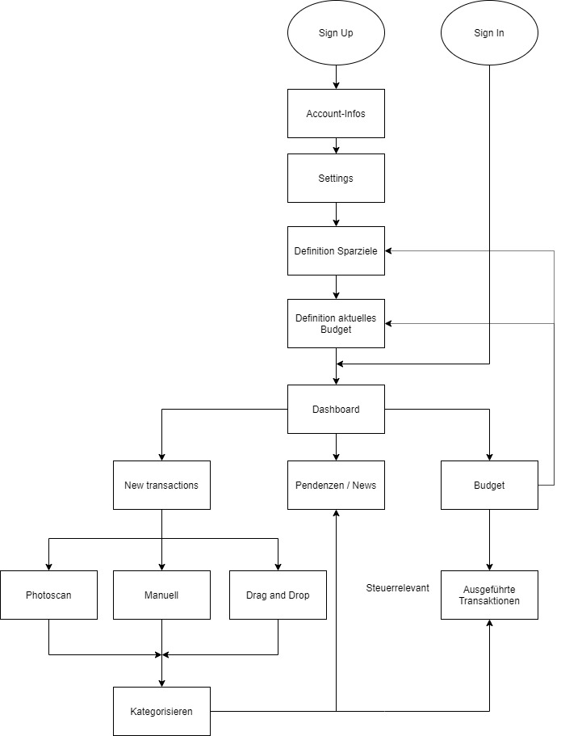

# Projekt: Oktofinance 2.0
## Ausgangslage / Problemstellung
Die bestehenden Spar und Budgetfunktionen der Banken im E-Banking, sind nicht sexy und machen keinen Spass. Die meisten Leute kennen diese Funktionen nicht einmal, da das E-Banking kein Ort ist, den man mit positiven Emotionen verbindet. Dementsprechend möchte man sich da nicht allzu lang darin aufhalten.

Der Zeitpunkt, wenn man darüber informiert wird, dass man sparen muss, ist nicht akkurat. Das Geld ist meistens schon ausgegeben bis man sich Ende Monat wieder im E-Banking einloggt und den dortigen Sparplaner aufruft, vorausgesetzt man kennt ihn überhaupt. Z.B. beim Onlineshopping wird man nicht daran erinnert, dass man sich diese Kleider nicht leisten kann.
Vielen Menschen fehlt die Motivation Rechnungen zu bezahlen. Dies ist auf verschiedene Gründe zurückzuführen. Einerseits schreckt die damit verbundene Umständlichkeit (Transaktionen kategorisieren, Sparziele festlegen, Analysen etc.) ein Teil der Benutzer ab andererseits sehen sich viele Menschen, aufgrund der fehlenden Weitsicht, finanziell an die Wand gedrängt, weshalb ein Zahlen von Rechnungen in ihrem Fall mit unangenehmen Emotionen verbunden ist.

Bei Papierrechnungen ist das Sortieren, Erinnern und Archivieren häufig ein Pain-Point. Z.B. Rechnungen die man bei den Steuern abziehen kann werden vergessen, gehen verloren oder man hat sie nicht zum richtigen Zeitpunkt zur Hand.

Im Zeitalter der Digitalisierung werden dem Kunden ein Grossteil der Rechnungen per Mail zugestellt. Dies bietet zwar viele Vorteile und scheint den Ansprüchen der heutigen User besser gerecht zu werden als eine Rechnung in Papierform. Aufgrund viele Mails und Spams geht die Übersicht im Posteingang verloren und man vergisst die Rechnungen zu begleichen.

## Lösungs Idee
In der heutigen Konsumgesellschaft ist Geld ist für jedermann von zentraler Bedeutung. Gemäss der obenstehenden Problembeschreibung sehen wir ein Grundsatzproblem, dass sparen nicht im Alltag integriert ist, obwohl dies fatale folgen haben kann, wenn man sein Vermögen nicht optimal verwaltet. Wir wollen, dass die Nutzer unserer Applikation eine Motivation haben sich mit dem Sparen auseinander zusetzen, damit sie keine Einschränkungen haben.

Ziel des Projektes ist eine Budgetplanungs-Applikation zu bauen mit welcher man sein Budget für verschiedene anstehende Ausgaben (z.B. Lebensmittel, Ferien, Kleider, Arztrechnungen etc.) des täglichen Lebens planen kann. Wir haben uns für eine Mobile-App entschieden, damit wir die oben beschriebene niederschwellige Art und Weise des sparens hinkriegen und sparen im Leben in Zukunft integriert sein wird.

## Funktion
In der App können Sparziele definiert werden (lang- und kurzfristige Ziele), Zahlungen geplant werden (Scan einer Rechnung, Manuelle Eingabe, Upload einer PDF-Rechnung aus dem Email), und sie gibt einem an wie viel man in den einzelnen Budgetposten im aktuellen Monat oder Jahr noch ausgeben darf. Weiter wird das Sparpotenzial grafisch dargestellt und mögliche Budget-Swaps (Verschiedene Konten und Ausgabeposten) werden mittels Pop-Up dem Nutzer angegeben. Somit sollte eine Übersicht über das aktuelle Vermögen gewährleistet sein. Bei einer Online-Bestellung wird ein Pop-Up erscheinen, welches dem User angibt, wie sich die Bestellsumme auf die eigenen Kontostände und Sparziele auswirkt. Ist die Steuerrechnung fällig (wird vom Nutzer anfangs Jahr angegeben), werden die Rechnungen dem User mitgeteilt, welche steuerrelevant sind.

## Workflow

### Prozess
- [ ] TODO

### Dateneingabe
Im Interface wir der User folgende Daten eingeben können:
- Aktuelles Vermögen/Gesamtbudget
- Angabe Budget pro Ausgabenposten - In welchen Bereichen ist wie viel Budget vorhanden?
- Eingabe der offenen Ausgaben und Rechnungen per Scan, manueller Angabe oder Upload als PDF-File
- Definition von kurz- und langfristigen Sparzielen
- Eingabe, wann die Steuerrechnung ausgefüllt wird
- Angabe des Sparzwangs (Stark, Mittel und leicht)

### Datenverarbeitung / Speicherung
- [ ] TODO

### Datenausgabe
- Überischt aller Ausgaben als Kuchendiagramm
- Übersicht des aktuellen Budgets als Balkendiagramm
- Anzeige Ausgabenverlauf im Liniendiagramm
- Anzeige Sparpotential als Balkendiagramm - wird im Budget grün dargestellt
- SMS Alert, sobald Budget überschritten wurde