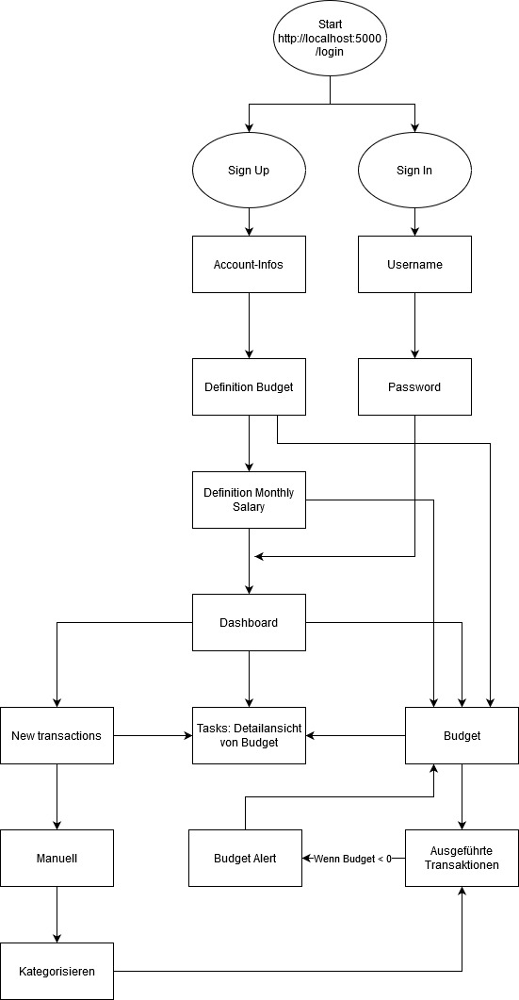

# Projekt: Oktofinance 2.0
## Ausgangslage / Problemstellung
Die bestehenden Spar und Budgetfunktionen im E-Banking sind nicht sexy und machen einfach keinen Spass. Die meisten Leute kennen diese Funktionen nicht einmal, da das E-Banking kein Ort ist, an dem man sich länger als nötig aufhalten möchte.

Ein weiteres Problem besteht darin, dass der Zeitpunkt, an dem man darauf hingewiesen wird, dass man jetzt spätestens sparen muss, in diesen Tools nicht akkurat ist. Das Geld ist meist schon ausgegeben, bis man sich Ende Monat wieder im E-Banking einloggt und den dortigen Sparplaner aufruft.
Vielen Menschen fehlt die Motivation ihr Budget zu planen. Der damit verbundene Aufwand (Transaktionen kategorisieren, Sparziele festlegen, Analysen etc.) schreckt einen Grossteil der potenziellen Nutzer ab.

## Projektidee
Wir wollen, eine Web-App programmieren, die durch Einfachheit und Nuterfreundlichkeit besticht. Dies soll die Nutzer motivieren, sich mit dem Sparen auseinanderzusetzen. Wir möchten ihnen dabei helfen, finanzielle Entscheide besser treffen zu können. 

Sparziele sollen keine weit entfernten Träume mehr darstellen, sondern Realität werden.

Ziel des Projektes ist eine Budgetplanungs-Applikation zu bauen, mit welcher man sein Budget für verschiedene anstehende Ausgaben (z.B. Lebensmittel, Ferien, Kleider, Arztrechnungen etc.) des täglichen Lebens planen kann. Wir haben uns für eine Web-App entschieden, damit Sparen wieder spass macht und man mit Freude sein Budget plant.

## Getting Started
1. Clone Repository https://github.com/cedriccarrel/prog2
2. Module: $ pip install Flask-Mail, conda install plotly, conda install -c conda-forge matplotlib
3. Start python app.py
4. Open http://localhost:5000/login
5. Siehe Funktionen / Walkthrough für Userjourney

## Funktionen / Walkthrough
### Login / Sign Up / Forgot Password
Um zu starten öffnen Sie: http://localhost:5000/login
Danach müssen Sie über die Sign Up-Funktion einen Account anlegen. Klicken Sie dafür auf Sign Up. Danach geben Sie einen Usernamen, E-Mail-Adresse, Passwort, Einkommen (muss höher als Budgetziel sein) und Budgetziel an. Falls die E-Mail Adresse bereits verwendet wurde, wird eine Fehlermeldung ausgegeben und die Daten werden nicht gespeichert. Ist die E-Mailadresse nicht vorhanden, wird ein User im Json angelegt und Sie landen im Dashboard.
Wenn der User registriert ist, kann er sich über die Loginfunktion, durch Eingabe seines Usernamen und Passwort, einloggen. Falls Username und Passwort nicht übereinstimmen, wird eine Fehlermeldung ausgegeben. Wenn man das Passwort vergessen hat, kann man sich dieses über die Forgot your Password-Funktion, durch Eingabe der hinterlegten E-Mail-Adresse (gemäss Sign Up Form), zuschicken lassen.

### Dashboard
Im Dashboard lassen sich die verschiedenen Funktionen der App aufrufen. Klicken Sie hierfür auf die Titel der einzelnen Boxen. Gehen Sie zuerst auf Create New Transaction.

### Create New Transaction
Über die Funktion "Create New Transactions" im Dashboard kann der Nutzer Zahlungen erfassen, welche danach vom, beim Sign Up definierten Budget, abgerechnet werden. Sobald man auf "Create" klickt, wird man auf die "Budget"-Seite geroutet. Dort wird einem eine Liste der bis dahin erfassten Zahlungen angezeigt. Im unteren Teil der Seite wird eine Übersicht über die aktuell berechneten Positionen dargestellt. Bsp. Ausgaben pro Hashtag, aktuelles Budget etc. (Bereich).
Um sich dies grafisch darstellen zu lassen, klicken Sie auf "View Stats" (Verweist auf /Budget). Wenn Sie das erledigt haben, kehren sie mit einem Klick auf "OktoFinance" (in der Navigation) wieder auf das Dashboard zurück. Beachten Sie die aktualisierten Kacheln.

### Ausgaben Statistik
Unter Ausgaben Statistik wird einem grafisch dargestellt, wieviel man in den einzelnen Budgetposten ausgibt. Die einzelnen Posten lassen sich durch einen Klick in der Legende ein/ausblenden. Dies Grafik lässt sich als PNG exportieren und weiterverwenden.
Dadurch ist eine Übersicht über das Budget, die getätigten Zahlungen und das aktuelle Vermögen gewährleistet. 

### Budget
Unter Budget werden einem die bei "New Transaction" erfassten Transaktionen angezeigt und als Tabelle mit Berechnungen übersichtlich dargestellt. Über den Link "View Stats", wechselt man auf die Diagramm-Ansicht der Ausgaben.

### Budget-Alert
1. Alert wird ausgelöst, wenn man unter " Create New Transaction" eine neue Ausgabe erfasst, welche das definierte Budget (gemäss Sign Up Form) übersteigt. Sie erhalten eine Mail mit dem aktuellen Budget. 
2. Alert wird ausgelöst, wenn Budget aufgebraucht ist und im Dashboard in der grünen Kachel auf "Budget Details" geklickt wird. Leider lässt das Budget nun nicht mehr anpassen, dies war nicht mehr im Scope aber lässt sich für eine zukünftige Version einfach implementieren.

## Flowchart Login

## Flowchart Web-App

### Dateneingabe
Im Sign Up (Registrierung) wird der User folgende Daten eingeben können:
- Username E-Mail-Adresse, Passwort, jährliches Einkommen, Gesamtbudget

Im Login (Anmeldung) wird der User folgende Daten eingeben:
- Username, Passwort

In "New Transactions":
- Angabe Budget pro Ausgabenposten - In welchen Bereichen ist wie viel Budget vorhanden?
- Manuelle Eingabe der offenen Ausgaben und Rechnungen
- Definition von kurz- und langfristigen Sparzielen

### Datenverarbeitung / Speicherung
- User Daten werden als json-Datei abgespeichert und sind persistent.
- Transaktionsdaten werden auch als json-Datei abgespeichert und sind persistent.

### Datenausgabe
- Passwort-Forget Funktion: Mail an Mailadresse des Users mit Angabe von Passwort und Username
- Alert-Mail: Kunde erhält E-Mail wenn Budget aufgebraucht
- Übersicht aller Ausgaben als Tabelle
- Übersicht der einzelnen Posten als Donut-Chart
- Berechnungen: pro Ausgabekategorie, Total Budget, Prozentangaben, Total Ausgaben, Anzahl Transaktion
